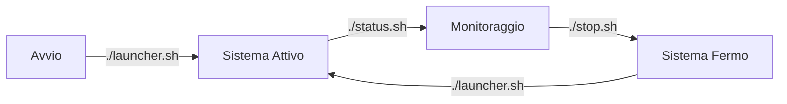

# 📋 Guida agli Script di Gestione

## 🎯 Perché 3 Script Separati?

I tre script (`launcher.sh`, `status.sh`, `stop.sh`) esistono per **separare le responsabilità** e seguire il principio di **single responsibility** nella gestione del sistema.

## 🔧 1. `launcher.sh` - Avvio del Sistema

### 📍 A cosa serve:
Avvia **tutto il sistema** (backend + frontend) in modo sicuro e controllato.

### 🚀 Cosa fa:
```bash
# 1. Pulizia iniziale
- Ferma eventuali processi esistenti
- Pulisce le porte 54324 e 8080
- Rimuove file temporanei

# 2. Avvio Backend
- Verifica che Gunicorn sia installato
- Avvia Gunicorn con 4 workers × 2 threads
- Configura logging e timeout
- Test che il backend risponda

# 3. Avvio Frontend
- Avvia Python HTTP Server sulla porta 8080
- Verifica che il frontend sia accessibile

# 4. Monitoraggio
- Salva i PID dei processi
- Mostra lo stato finale
- Fornisce comandi utili
```

### 📌 Quando usarlo:
- **All'avvio del sistema**
- **Dopo un aggiornamento**
- **Quando vuoi riavviare tutto**

### 💡 Esempio:
```bash
./launcher.sh
```

---

## 📊 2. `status.sh` - Monitoraggio Stato

### 📍 A cosa serve:
Verifica lo **stato corrente** del sistema senza modificare nulla.

### 🚀 Cosa fa:
```bash
# 1. Controllo Backend
- Verifica se il backend risponde (porta 54324)
- Mostra il modello Ollama in uso
- Verifica il processo Gunicorn

# 2. Controllo Frontend
- Verifica se il frontend risponde (porta 8080)
- Verifica il processo HTTP Server

# 3. Statistiche Sistema
- Mostra memoria totale e usata
- Mostra utilizzo CPU
- Mostra spazio disco

# 4. Informazioni Utili
- Mostra dimensioni file di log
- Fornisce comandi rapidi
```

### 📌 Quando usarlo:
- **Per verificare che tutto funzioni**
- **Durante l'uso per monitorare**
- **Per debugging**

### 💡 Esempio:
```bash
./status.sh
```

---

## 🛑 3. `stop.sh` - Arresto Sicuro

### 📍 A cosa serve:
Ferma **tutti i processi** in modo pulito e sicuro.

### 🚀 Cosa fa:
```bash
# 1. Lettura PID
- Legge i PID salvati da launcher.sh
- Ferma i processi usando i PID salvati

# 2. Pulizia Processi
- Ferma eventuali processi residui
- Pulisce le porte 54324 e 8080

# 3. Pulizia File
- Rimuove file temporanei
- Pulisce cache

# 4. Conferma
- Verifica che tutto sia fermo
- Mostra messaggio di conferma
```

### 📌 Quando usarlo:
- **Prima di aggiornare**
- **Quando vuoi fermare il sistema**
- **In caso di problemi**

### 💡 Esempio:
```bash
./stop.sh
```

---

## 🎯 Perché Non Un Solo Script?

### ✅ Vantaggi della Separazione:

1. **Sicurezza**:
   - `stop.sh` può essere eseguito senza rischi
   - `launcher.sh` ha permessi di scrittura
   - `status.sh` è solo lettura

2. **Modularità**:
   - Ogni script fa una cosa sola
   - Facile da modificare e testare
   - Riutilizzabile in altri contesti

3. **Controllo**:
   - Puoi verificare lo stato senza avviare/fermare
   - Puoi fermare senza dover avviare
   - Puoi avviare senza dover fermare

4. **Automazione**:
   - Facile da integrare in sistemi esterni
   - Puoi chiamare solo lo script che ti serve
   - Adatto per cron job e monitoring

5. **Debugging**:
   - Ogni script ha il suo log
   - Errori più facili da tracciare
   - Output più chiaro

---

## 📋 Esempi di Uso Combinato

### 🔄 Riavvio Completo:
```bash
./stop.sh
./launcher.sh
./status.sh
```

### 🕒 Monitoraggio Periodico:
```bash
while true; do
    ./status.sh
    sleep 60
done
```

### 📊 Log Automatici:
```bash
./status.sh >> logs/system_status_$(date +%Y%m%d).log
```

### 🔧 Aggiornamento:
```bash
./stop.sh
git pull origin main
./launcher.sh
```

---

## 🎨 Flusso Tipico di Utilizzo



1. **Avvio**: `./launcher.sh` → Sistema parte
2. **Monitoraggio**: `./status.sh` → Verifica stato
3. **Fermo**: `./stop.sh` → Sistema si ferma
4. **Riavvio**: `./launcher.sh` → Sistema riparte

---

## 🔧 Alternative (Se Preferisci Un Solo Script)

Se vuoi un solo script, puoi creare un **super-script** che fa tutto:

```bash
#!/bin/bash
# super_script.sh

case "$1" in
    start)
        ./launcher.sh
        ;;
    stop)
        ./stop.sh
        ;;
    status)
        ./status.sh
        ;;
    restart)
        ./stop.sh
        ./launcher.sh
        ;;
    *)
        echo "Uso: $0 {start|stop|status|restart}"
        ;;
esac
```

Ma la separazione attuale è **più professionale** e segue le best practices.

---

## 📊 Confronto con Altri Sistemi

| Sistema | Script Separati | Vantaggi |
|---------|----------------|----------|
| **Docker** | `docker start`, `docker stop`, `docker ps` | Modularità |
| **Systemd** | `systemctl start`, `systemctl stop`, `systemctl status` | Sicurezza |
| **Nginx** | `nginx`, `nginx -s stop`, `nginx -t` | Controllo |
| **Assistente AI** | `launcher.sh`, `stop.sh`, `status.sh` | Chiarezza |

---

## 🎯 Conclusione

I tre script esistono per **migliorare la gestione del sistema** seguendo le best practices della programmazione:

1. **Single Responsibility Principle**
2. **Separation of Concerns**
3. **Modular Design**
4. **Ease of Maintenance**

Questa struttura ti permette di:
- ✅ Avviare il sistema in modo sicuro
- ✅ Monitorare lo stato senza interferire
- ✅ Fermare tutto in modo pulito
- ✅ Automare le operazioni
- ✅ Debuggare facilmente

**Raccomandazione**: Mantieni i tre script separati per una gestione professionale del sistema! 🎉